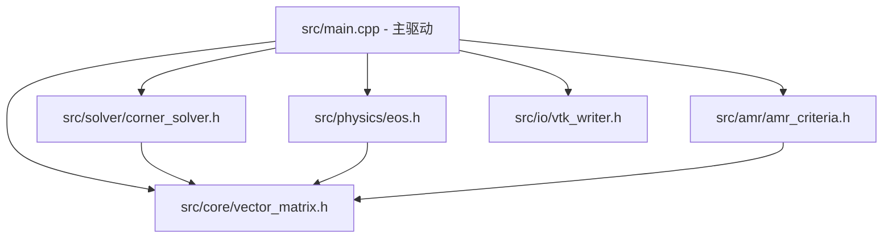

# Lagrangian-AMR: High-Performance 2D Hydrodynamics Solver with Adaptive Mesh Refinement

[](LICENSE)
[]()
[-success.svg)]()

`Lagrangian-AMR` 是一款基于 **p4est** 四叉树（Quadtree）并行网格自适应（Adaptive Mesh Refinement, AMR）的高性能二维拉格朗日流体力学（Lagrangian Hydrodynamics）求解器。

项目经过重构，具备清晰的 6 层模块化 C++ 架构、完整的基于 MS-MPI 的并行计算能力，以及与基准参考解（`reference/ref.vtu`）达到 `< 1e-12` 零偏差级别的强力回归自动化校验 SOP。

---

## 🌟 核心特性 (Key Features)

- **拉格朗日流体力学求解器**：基于单元中心（Cell-Centered）与角点节点（Corner Node）力/速度求解的拉格朗日压缩流体力学算法。
- **p4est 动态网格自适应 (AMR)**：支持基于梯度估计与 MinMod 限制器的单元级自适应细化（Refine）与粗化（Coarsen）以及网格平衡（Balance）。
- **模块化 C++ 架构**：核心数学库、物理内核/EOS、AMR 准则、节点求解器与 VTK 导出解耦为独立领域头文件。
- **并行计算与 MS-MPI 适配**：高度适配 Windows MSYS2 UCRT64 + Microsoft MPI (MS-MPI) 构建与并行运行环境。
- **零偏差回归测试 (Regression Verification)**：配套 Python VTK 数据比较工具（`compare_vtu.py`），提供 100% 可重复的 8 物理场零偏差（`tol < 1e-12`）门禁校验。

---

## 🏗️ 架构设计 (Architecture Blueprint)

```
Lagrangian-AMR/
├── src/
│   ├── core/               # 基础数学结构 (CDoubleVector, CDoubleMatrix)
│   ├── physics/            # 物理内核与状态方程 (EOS, 声速, 单元质量)
│   ├── amr/                # AMR 自适应准则 (Refine/Coarsen Error Estimation)
│   ├── solver/             # 角点节点速度求解器与线性方程组矩阵组装
│   ├── io/                 # 高层 VTK 导出与诊断流助手
│   ├── alg.h / alg.cpp     # 几何与基础辅助算法
│   ├── defines.h           # p4est 与计算变量全局结构定义
│   ├── variable.h          # 全局变量容器类 (CVariable)
│   └── main.cpp            # 精简模块化主驱动程序
├── reference/
│   └── ref.vtu             # 1000 步基准参考解 VTU 文件
├── bin/                    # 可执行文件与输出目录 (bin/AMR_Solver.exe, bin/output/)
├── compare_vtu.py          # VTK 自动化零偏差回归校验脚本
├── Makefile                # MSYS2 / MinGW 编译规则脚本
└── CMakeLists.txt          # Modern CMake 构建配置文件
```

### 模块依赖关系



---

## 🛠️ 环境要求 (Prerequisites)

- **操作系统**：Windows 10 / 11 或 Linux / macOS
- **编译器**：支持 C++14 的 GCC / Clang（Windows 推荐 [MSYS2 UCRT64](https://www.msys2.org/) 环境下的 `g++.exe`）
- **MPI 库**：[Microsoft MPI (MS-MPI)](https://learn.microsoft.com/en-us/message-passing-interface/microsoft-mpi)
- **网格库**：[p4est 2.8.5+](https://www.p4est.org/)（源码第三库已置于 `third_party/p4est`）
- **Python 环境**：Python 3.x（用于运行 `compare_vtu.py` 比对脚本，需安装 `vtk` 库：`pip install vtk`）

---

## 🚀 编译与运行 (Build & Run)

### 方式一：使用 Makefile（推荐 Windows MSYS2 / UCRT64）

1. **清理构建环境**：
   ```powershell
   $env:PATH="C:\msys64\usr\bin;" + $env:PATH
   make clean
   ```

2. **编译求解器**：
   ```powershell
   $env:PATH="C:\msys64\usr\bin;C:\msys64\ucrt64\bin;" + $env:PATH
   make
   ```
   *编译成功后将在 `bin/` 目录下生成 `AMR_Solver.exe`。*

3. **运行单进程仿真**：
   ```powershell
   cd bin
   & "$env:ProgramFiles/Microsoft MPI/Bin/mpiexec.exe" -n 1 ./AMR_Solver.exe
   ```

4. **运行多进程 MPI 仿真**（例如 4 进程）：
   ```powershell
   cd bin
   & "$env:ProgramFiles/Microsoft MPI/Bin/mpiexec.exe" -n 4 ./AMR_Solver.exe
   ```

---

### 方式二：使用 CMake

```bash
mkdir build_cmake && cd build_cmake
cmake .. -G "MinGW Makefiles" -DCMAKE_BUILD_TYPE=Release
cmake --build .
```

---

## 🧪 自动化回归测试与校验 (Regression Testing SOP)

为保证代码重构或新功能开发不偏离原拉格朗日物理解状态，项目配备了自动化校验 SOP：

```powershell
# 1. 运行仿真并生成目标输出文件 bin/output/p4est_Lagrangian_1000_0000.vtu
cd bin
& "$env:ProgramFiles/Microsoft MPI/Bin/mpiexec.exe" -n 1 ./AMR_Solver.exe

# 2. 返回项目根目录，执行比对测试（容差 1e-12）
cd ..
python compare_vtu.py --target bin/output/p4est_Lagrangian_1000_0000.vtu --ref reference/ref.vtu --tol 1e-12
```

### 校验项与合格标准

脚本将全面比对网格结构（节点数、单元数）及 8 个核心物理场：
- `density` (密度)
- `Pressure` (压力)
- `internal_energy` (内能)
- `NodeX`, `NodeY` (节点坐标)
- `NodeU`, `NodeV` (节点速度)
- `Position` (单元位置)

若所有物理场绝对误差均 `< 1.0e-12`，则判定为 `[PASS]`。

---

## 📜 许可协议 (License)

本项目基于 [MIT License](LICENSE) 开源。欢迎贡献代码与提交 Issue！
