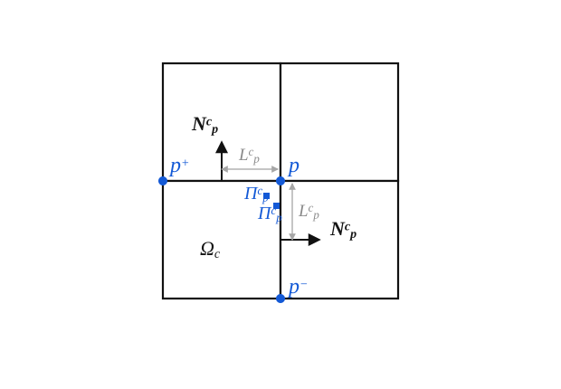

# Mathematical Formulation for Cell-Centered Lagrangian Hydrodynamics

## 1. 2D Lagrangian Compressible Fluid Dynamics Governing Equations

For a 2D inviscid, compressible fluid, the integral conservation laws over a moving control volume $\Omega(t)$ with boundary $\partial\Omega(t)$ and outward unit normal $\mathbf{N}$ are given by:

- **Geometric Conservation Law (GCL) / Volume:**
  $$ \frac{d}{dt} \int_{\Omega} d\Omega - \int_{\partial\Omega} \mathbf{U} \cdot \mathbf{N} dL = 0 $$
- **Conservation of Mass:**
  $$ \frac{d}{dt} \int_{\Omega} \rho d\Omega = 0 $$
- **Conservation of Momentum:**
  $$ \frac{d}{dt} \int_{\Omega} \rho \mathbf{U} d\Omega + \int_{\partial\Omega} P \mathbf{N} dL = \mathbf{0} $$
- **Conservation of Total Energy:**
  $$ \frac{d}{dt} \int_{\Omega} \rho E d\Omega + \int_{\partial\Omega} P \mathbf{U} \cdot \mathbf{N} dL = 0 $$

The system is closed by the ideal gas Equation of State (EOS):
$$ P = (\gamma - 1)\rho e, \quad e = E - \frac{1}{2}|\mathbf{U}|^2 $$

## 2. Corner Nodal Velocity Solver & Decoupled Kinematic-Constrained Formulation

### 2.1 Baseline Corner Nodal Solver: Acoustic Compatibility and Velocity Derivation

The baseline closure applies to an interior, non-hanging node in a planar mesh.
Normals point outward from their cell, and $\mathbf{F}_{cp}$ is the corner flux
used in the cell update $-\sum_p\mathbf{F}_{cp}$.

#### 2.1.1 Corner half-edge geometry and notation

For vertex $p$ of cell $c$, let the two incident half-edges be $(L_{cp}^{+},
\mathbf{N}_{cp}^{+})$ and $(L_{cp}^{-},\mathbf{N}_{cp}^{-})$, where each
$\mathbf{N}_{cp}^{\pm}$ is an outward unit normal.  For straight-sided cells,

$$
L_{cp}^{+}=\frac{1}{2}L_{p p^{+}}^{c},\qquad
L_{cp}^{-}=\frac{1}{2}L_{p p^{-}}^{c},
$$

$$
\mathbf{N}_{cp}
= L_{cp}^{+}\mathbf{N}_{cp}^{+}
+ L_{cp}^{-}\mathbf{N}_{cp}^{-}.
$$

The length-weighted vector $\mathbf{N}_{cp}$, rather than a unit normal, enters
the pressure force.

*Figure 1. Corner half-edge geometry, adapted from Figure 1 in
`only_nodal_solver.pdf` (PDF page 4; printed page 3).*

#### 2.1.2 Linear acoustic jump relation on each half-edge

For $(\rho_c,P_c,\mathbf{U}_c)$, define

$$
a_c=\sqrt{\frac{\gamma P_c}{\rho_c}},\qquad Z_c=\rho_c a_c.
$$

With $u_n=\mathbf{U}\cdot\mathbf{N}_{cp}^{\pm}$, the linear acoustic system
and its characteristic relations are

$$
\partial_t u_n+\frac{1}{\rho_c}\partial_n P=0,\qquad
\partial_t P+\rho_c a_c^2\partial_n u_n=0,
$$

$$
dP \pm Z_c\,du_n=0,\qquad \lambda=\pm a_c.
$$

The characteristic leaving cell $c$ gives the half-edge numerical pressure

$$
\boxed{
\pi_{cp}^{\pm}
= P_c-Z_c\bigl(\mathbf{U}_p-\mathbf{U}_c\bigr)
\cdot\mathbf{N}_{cp}^{\pm}.
}
$$

All cells at $p$ share $\mathbf{U}_p$.  This is the multi-dimensional velocity
compatibility condition.  `only_nodal_solver.pdf` uses an alternative normal/
traction orientation and therefore displays the correction with the opposite
sign; normal, traction, and balance conventions must always be transformed
together.

#### 2.1.3 Corner force and acoustic impedance matrix

$$
\mathbf{F}_{cp}
=\pi_{cp}^{+}L_{cp}^{+}\mathbf{N}_{cp}^{+}
 +\pi_{cp}^{-}L_{cp}^{-}\mathbf{N}_{cp}^{-}
=P_c\mathbf{N}_{cp}
-\mathbf{M}_{cp}\bigl(\mathbf{U}_p-\mathbf{U}_c\bigr),
$$

$$
\boxed{
\mathbf{M}_{cp}
=Z_c\left[
L_{cp}^{+}
\bigl(\mathbf{N}_{cp}^{+}\otimes\mathbf{N}_{cp}^{+}\bigr)
+L_{cp}^{-}
\bigl(\mathbf{N}_{cp}^{-}\otimes\mathbf{N}_{cp}^{-}\bigr)
\right].
}
$$

Here $(\mathbf{n}\otimes\mathbf{n})\mathbf{v}
=\mathbf{n}(\mathbf{n}\cdot\mathbf{v})$.  Thus $\mathbf{M}_{cp}$ damps the
normal relative velocity.  It is stored in `MarCnData[idcnMcp]`; cylindrical
branches additionally apply $R_{cp}$, while the planar baseline has $R_{cp}=1$.

#### 2.1.4 Nodal force balance and derivation of $\mathbf{U}_p$

A regular interior node has no external or constraint force, so

$$
\sum_{c\in\mathcal{C}(p)}\mathbf{F}_{cp}=\mathbf{0}.
$$

Substitution of the corner force yields

$$
\sum_{c\in\mathcal{C}(p)}
\left[
P_c\mathbf{N}_{cp}
-\mathbf{M}_{cp}\bigl(\mathbf{U}_p-\mathbf{U}_c\bigr)
\right]=\mathbf{0},
$$

$$
\left(\sum_{c\in\mathcal{C}(p)}\mathbf{M}_{cp}\right)\mathbf{U}_p
=
\sum_{c\in\mathcal{C}(p)}
\left(\mathbf{M}_{cp}\mathbf{U}_c+P_c\mathbf{N}_{cp}\right).
$$

Therefore,

$$
\mathbf{M}_p=\sum_{c\in\mathcal{C}(p)}\mathbf{M}_{cp},\qquad
\mathbf{b}_p=
\sum_{c\in\mathcal{C}(p)}
\left(\mathbf{M}_{cp}\mathbf{U}_c+P_c\mathbf{N}_{cp}\right),
$$

$$
\boxed{
\mathbf{U}_p=\mathbf{M}_p^{-1}\mathbf{b}_p
=\mathbf{M}_p^{-1}
\sum_{c\in\mathcal{C}(p)}
\left(\mathbf{M}_{cp}\mathbf{U}_c+P_c\mathbf{N}_{cp}\right).
}
$$

If the incident normals span two dimensions, $\mathbf{M}_p$ is symmetric
positive definite and the velocity is unique.  Boundary and hanging nodes use
their respective closures.

Equivalently, the same velocity is the stationary point of

$$
\mathcal{J}_p(\mathbf{U})
=\frac{1}{2}\sum_{c\in\mathcal{C}(p)}
(\mathbf{U}-\mathbf{U}_c)^T\mathbf{M}_{cp}
(\mathbf{U}-\mathbf{U}_c)
-\sum_{c\in\mathcal{C}(p)}P_c\mathbf{N}_{cp}\cdot\mathbf{U}.
$$

#### 2.1.5 Correspondence with the solver data path

The solver accumulates

$$
\mathbf{b}_{cp}=P_c\mathbf{N}_{cp}+\mathbf{M}_{cp}\mathbf{U}_c,
\qquad \mathbf{M}_p=\sum_c\mathbf{M}_{cp},\qquad
\mathbf{b}_p=\sum_c\mathbf{b}_{cp},
$$

then computes $\mathbf{U}_p=\mathbf{M}_p^{-1}\mathbf{b}_p$.  The data path is
`MarCnData[idcnMcp]` $\rightarrow$ `VecCnData[idcnRHS]` $\rightarrow$
`points[].MatrixP` / `points[].RHS` $\rightarrow$ `points[].velo_lag`.

### 2.2 HLLC–ALE Contact-Resolving Nodal Solver

This section gives the HLLC extension of the acoustic closure in Section 2.1.
It is a mathematical design derived from `riemann_solver_part2_ale.md`; the
active implementation remains the baseline solver of Section 2.1.  HLLC first
resolves a contact wave on each edge, then computes one geometrically compatible
vector velocity at every node.

#### 2.2.1 One-dimensional HLLC wave model on an oriented edge

Let an edge have unit normal $\mathbf{n}$ directed from state $L$ to state $R$
and unit tangent $\mathbf{t}$.  Define

$$
u_K=\mathbf{U}_K\cdot\mathbf{n},\qquad
\tau_K=\mathbf{U}_K\cdot\mathbf{t},\qquad K\in\{L,R\},
$$

and use the normal Euler state and flux

$$
\mathbf{Q}=
\begin{bmatrix}\rho\\\rho\nu\\\rho\tau\\\rho E\end{bmatrix},
\qquad
\mathbf{F}_n(\mathbf{Q})=
\begin{bmatrix}
\rho\nu\\
\rho\nu^2+P\\
\rho\nu\tau\\
(\rho E+P)\nu
\end{bmatrix}.
$$

The HLLC fan contains the bounding waves $S_L<S_R$ and a contact wave $S_*$:

$$
\mathbf Q_L\;\xrightarrow{S_L}\;\mathbf Q_L^*
\;\xrightarrow{S_*}\;\mathbf Q_R^*
\;\xrightarrow{S_R}\;\mathbf Q_R.
$$

Across the contact, normal velocity and pressure are continuous while density
may jump:

$$
\nu_L^*=\nu_R^*=S_*,\qquad P_L^*=P_R^*=P^*,
\qquad \tau_K^*=\tau_K.
$$

Across either outer wave, the Rankine--Hugoniot relation is

$$
\mathbf{F}_{n,K}^*-\mathbf{F}_{n,K}
=S_K\bigl(\mathbf{Q}_K^*-\mathbf{Q}_K\bigr),
\qquad K\in\{L,R\}.
$$

The mass, normal-momentum, and energy components give

$$
\rho_K^*=\rho_K\frac{S_K-\nu_K}{S_K-S_*},
\qquad
P^*=P_K+\rho_K(S_K-\nu_K)(S_*-\nu_K),
$$

$$
(\rho E)_K^*=
\frac{(S_K-\nu_K)\rho_KE_K-P_K\nu_K+P^*S_*}{S_K-S_*}.
$$

The outer-speed estimates must bound the physical signal speeds, for example
$S_L\leq\min(\nu_L-a_L,\nu_R-a_R)$ and
$S_R\geq\max(\nu_L+a_L,\nu_R+a_R)$ for a Davis-type bound.

#### 2.2.2 Contact speed and star pressure from the wave impedances

Introduce the positive nonlinear wave impedances

$$
\alpha_L=-\rho_L(S_L-\nu_L)>0,\qquad
\alpha_R=\rho_R(S_R-\nu_R)>0.
$$

The two momentum jump relations become

$$
P^*=P_L-\alpha_L(S_*-\nu_L),
\qquad
P^*=P_R+\alpha_R(S_*-\nu_R).
$$

Equating them yields the edge-local HLLC contact speed and pressure:

$$
\boxed{
\nu^*\equiv S_*
=\frac{P_R-P_L+\alpha_L\nu_L+\alpha_R\nu_R}
{\alpha_L+\alpha_R},
}
$$

$$
\boxed{
P^*
=\frac{\alpha_RP_L+\alpha_LP_R
-\alpha_L\alpha_R(\nu_R-\nu_L)}{\alpha_L+\alpha_R}.
}
$$

Thus HLLC retains the contact and shear fields that a two-wave HLL model
smears.  In particular, a material contact with equal pressure and normal
velocity has $S_*=\nu_L=\nu_R$, despite a density jump.

#### 2.2.3 ALE flux and the Lagrangian zero-mass-flux limit

For a face whose normal mesh speed is $w$, the ALE flux is

$$
\widehat{\mathbf F}_n(\mathbf Q)=\mathbf F_n(\mathbf Q)-w\mathbf Q.
$$

The HLLC star flux on side $K$ is consequently

$$
\widehat{\mathbf F}_{n,K}^*
=\mathbf F_{n,K}+S_K(\mathbf Q_K^*-\mathbf Q_K)-w\mathbf Q_K^*,
$$

with the usual HLLC wave ordering applied to the relative speeds
$S_L-w$, $S_*-w$, and $S_R-w$.  In the pure Lagrangian limit the mesh follows
the contact, $w=S_*$, and the star-region mass flux vanishes exactly:

$$
\widehat F_{\rho,K}^*
=\rho_K^*(\nu_K^*-w)
=\rho_K^*(S_*-S_*)=0.
$$

This is the one-dimensional contact-preservation property that the nodal
construction carries into the moving two-dimensional mesh.

#### 2.2.4 From edge predictions to one compatible two-dimensional node velocity

At node $q$, let $\mathcal E(q)$ be the incident edges.  For edge $e$, choose
$\mathbf n_e$ from its $L$ state to its $R$ state, let $L_e$ be its length, and
compute the local HLLC prediction $\nu_e^*$ from Section 2.2.2.  Independent
edge solves generally give incompatible scalar values
$\mathbf U_q^*\cdot\mathbf n_e\neq\nu_e^*$; a single node velocity is found
by imposing the impedance-weighted residual balance

$$
\sum_{e\in\mathcal E(q)}
L_e(\alpha_{L,e}+\alpha_{R,e})
\left(\mathbf U_q^*\cdot\mathbf n_e-\nu_e^*\right)
\mathbf n_e=\mathbf0.
$$

Using $(\mathbf U_q^*\cdot\mathbf n_e)\mathbf n_e
=(\mathbf n_e\otimes\mathbf n_e)\mathbf U_q^*$ gives

$$
\boxed{\mathbf M_q\mathbf U_q^*=\mathbf b_q,}
$$

$$
\boxed{
\mathbf M_q=
\sum_{e\in\mathcal E(q)}L_e(\alpha_{L,e}+\alpha_{R,e})
(\mathbf n_e\otimes\mathbf n_e),
\qquad
\mathbf b_q=
\sum_{e\in\mathcal E(q)}L_e(\alpha_{L,e}+\alpha_{R,e})
\nu_e^*\mathbf n_e.
}
$$

Equivalently, $\mathbf U_q^*$ minimizes

$$
\mathcal J_q(\mathbf U)=\frac12
\sum_{e\in\mathcal E(q)}L_e(\alpha_{L,e}+\alpha_{R,e})
\left(\mathbf U\cdot\mathbf n_e-\nu_e^*\right)^2.
$$

For any nonzero $\boldsymbol\xi$,

$$
\boldsymbol\xi^T\mathbf M_q\boldsymbol\xi
=\sum_{e\in\mathcal E(q)}L_e(\alpha_{L,e}+\alpha_{R,e})
(\boldsymbol\xi\cdot\mathbf n_e)^2.
$$

Hence $\mathbf M_q$ is symmetric positive definite when the incident normals
span two dimensions, and $\mathbf U_q^*=\mathbf M_q^{-1}\mathbf b_q$ is unique.

#### 2.2.5 Half-edge star pressures, corner forces, and the acoustic limit

The compatible node velocity need not retain each independent edge prediction.
Set $S_{q,e}^*=\mathbf U_q^*\cdot\mathbf n_e$ and reconstruct side-specific
half-edge star pressures:

$$
P_{L,q,e}^*=P_{L,e}-\alpha_{L,e}(S_{q,e}^*-\nu_{L,e}),
\qquad
P_{R,q,e}^*=P_{R,e}+\alpha_{R,e}(S_{q,e}^*-\nu_{R,e}),
$$

$$
P_{L,q,e}^*-P_{R,q,e}^*
=(\alpha_{L,e}+\alpha_{R,e})(\nu_e^*-S_{q,e}^*).
$$

This controlled pressure difference is the multidimensional correction that
reconciles all edge predictions at one node.  The outward corner force of cell
$c$ is assembled from its two incident half-edges,

$$
\mathbf F_{cq}^{\mathrm{HLLC}}
=\sum_{e\in\mathcal E(c,q)}L_{cqe}P_{c,q,e}^*\mathbf n_{c,e},
$$

and is used in the same conservative momentum and work updates as Section 3:

$$
m_c\frac{d\mathbf U_c}{dt}=-\sum_q\mathbf F_{cq}^{\mathrm{HLLC}},
\qquad
m_c\frac{dE_c}{dt}=-\sum_q
\mathbf F_{cq}^{\mathrm{HLLC}}\cdot\mathbf U_q^*.
$$

For the acoustic choices $S_L=\nu_L-a_L$ and $S_R=\nu_R+a_R$,

$$
\alpha_L=\rho_La_L=Z_L,\qquad
\alpha_R=\rho_Ra_R=Z_R.
$$

After each edge is split into its incident cell half-edges, the HLLC nodal
matrix and right-hand side reduce to the impedance matrix and pressure-corrected
right-hand side of Section 2.1.  Thus the baseline solver is the acoustic
limit of this contact-resolving HLLC–ALE construction.

### 2.3 Hanging Node Kinematic Constraint
For a hanging node $h$ between master nodes $p_1$ and $p_2$, the decoupled collinearity constraint uniquely dictates its velocity:
$$ \mathbf{U}_h = \frac{1}{2} (\mathbf{U}_{p_1} + \mathbf{U}_{p_2}) $$
The constraint force (Lagrange multiplier) required to enforce this collinearity is computed *a posteriori*:
$$ \boldsymbol{\lambda}_h = -\mathbf{M}_h \mathbf{U}_h + \sum_{c \in \mathcal{C}(h)} \left( \mathbf{M}_h^c \mathbf{U}_c - P_c L_h^c \mathbf{N}_h^c \right) $$

### 2.4 Thermal-Inertia Internal-Energy-Weighted Partition
To redistribute the constraint force conservatively and robustly, we use internal-energy-weighted partition coefficients:
$$ \alpha_{ch} = \frac{m_c e_c}{\sum_{k \in \mathcal{C}(h)} m_k e_k} $$

## 3. Spatio-Temporal Discretization Scheme

The semi-discrete finite volume equations are advanced using a **1st-order explicit forward Euler scheme**.

1. **Geometry Initialization:** Compute half-edge lengths $L_k^c$ and normals $\mathbf{N}_k^c$.
2. **Standard Nodal Solver:** Calculate $\mathbf{U}_p$ for regular nodes.
3. **Hanging Nodal Solver:** Calculate $\mathbf{U}_h = \frac{1}{2}(\mathbf{U}_{p_1} + \mathbf{U}_{p_2})$ and constraint force $\boldsymbol{\lambda}_h$.
4. **State Update (Momentum & Energy):**
   $$ m_c \frac{\mathbf{U}_c^{n+1} - \mathbf{U}_c^n}{\Delta t} = - \sum_{p} \mathbf{F}_{cp} - \sum_{h} \alpha_{ch}\boldsymbol{\lambda}_h $$
   $$ m_c \frac{E_c^{n+1} - E_c^n}{\Delta t} = - \sum_{p} \mathbf{F}_{cp} \cdot \mathbf{U}_p - \sum_{h} \alpha_{ch}\boldsymbol{\lambda}_h \cdot \mathbf{U}_h $$
5. **Coordinate Update:** $\mathbf{X}_k^{n+1} = \mathbf{X}_k^n + \Delta t \mathbf{U}_k^n$
6. **Thermodynamic Update:** Update $V_c^{n+1}$, $\rho_c^{n+1} = m_c/V_c^{n+1}$, and $P_c^{n+1}$.

### Adaptation Time Step Limiters
The time step $\Delta t^n$ obeys the standard CFL condition ($C_{CFL} = 0.2$), limited by:
- Maximum relative volume change: $|\Delta V_c / V_c| \leq 10\%$
- Growth limit: $\Delta t^{n+1} \leq 1.1 \Delta t^n$

## 4. Mathematical Criteria for Mesh Adaptation (`p4est`)

- **Refinement/Coarsening Indicators:** Gradient-based indicators of density ($\nabla \rho$) or pressure ($\nabla P$), mapped to predefined threshold levels.
- **Topology Balancing:** Maintains a strict 2:1 quadtree balance rule (at most one hanging node per edge).
- **Intersection-Based Conservative Remap (Coarsening):**
  When fine child cells merge into a parent cell, mass, momentum, and energy are conserved algebraically:
  $$ m_p = \sum_i m_i, \quad (\mathbf{mU})_p = \sum_i m_i \mathbf{U}_i, \quad (\mathbf{mE})_p = \sum_i m_i E_i $$

## 5. Physical Variable Mapping Table

Based on `src/variable.h` and `src/defines.h`, the C++ solver variables are classified to facilitate data structure refactoring:

| Variable Description | Category | Struct/Array Mapping |
| :--- | :--- | :--- |
| **Mass** ($m_c$) | Primary State | `quad_data_t.m_vara.DouCData[idMass]` |
| **Density** ($\rho_c$) | Primary State | `quad_data_t.m_vara.DouCData[idDensity_cur]` |
| **Pressure** ($P_c$) | Primary State | `quad_data_t.m_vara.DouCData[idPressure_cur]` |
| **Internal Energy** ($e_c$) | Primary State | `quad_data_t.m_vara.DouCData[idInternalEnergy_cur]` |
| **Total Energy** ($E_c$) | Primary State | `quad_data_t.m_vara.DouCData[idTotalEnergy_cur]` |
| **Cell Velocity** ($\mathbf{U}_c$) | Primary State | `quad_data_t.m_vara.VecCData[idCentroidVelo_cur]` |
| **Node Coordinates** ($\mathbf{X}_p$) | Primary State | `quad_data_t.init_node_coords`, `points.hanging_coord` |
| **Node Velocity** ($\mathbf{U}_p$) | Primary State | `quad_data_t.points[i].velo_lag`, `VecCnData[idcnVelocity_cur]` |
| **Cell Volume** ($V_c$) | Geometrical | `quad_data_t.m_vara.DouCData[idVolume]` |
| **Half-Edge Lengths** ($L_{cp}$) | Geometrical | `CCorner_data.hdata[].Lcp` |
| **Outward Normals** ($\mathbf{N}_{cp}$) | Geometrical | `CCorner_data.hdata[].Ncp` |
| **Cell Centroid** | Geometrical | `quad_data_t.m_vara.VecCData[idCentroidCoord_cur]` |
| **Subcell Matrix** ($\mathbf{M}_p^c$) | Solver Cache | `quad_data_t.m_vara.MarCnData[idcnMcp]` |
| **Nodal Matrix** ($\mathbf{M}_p$) | Solver Cache | `quad_data_t.points[i].MatrixP` |
| **Right-Hand Side** ($\mathbf{RHS}$) | Solver Cache | `quad_data_t.points[i].RHS`, `VecCnData[idcnRHS]` |
| **Constraint Force** ($\boldsymbol{\lambda}_h$) | Solver Cache | Represented inside `RHS` closures and `Fcp` |
| **Predictor/Half States** | Solver Cache | `DouCData[idPressure_half]`, `VecCData[idCentroidVelo_half]` |
