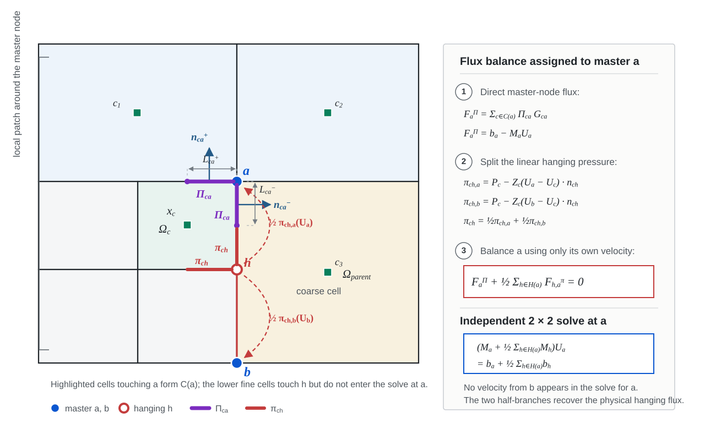
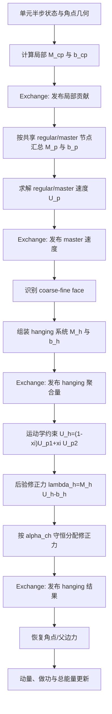

# Regular/Master 与 Hanging Node 节点求解器

本文给出 Lagrangian-AMR 中两类节点速度求解器的统一推导和算法流程：

1. **Regular/Master 节点求解器**：对普通共享节点组装声阻抗矩阵，求解唯一节点速度；非协调粗边两端的 master 节点也由这一求解器处理。
2. **Hanging node 节点求解器**：先由相邻 master 节点确定运动学约束速度，再计算后验约束修正力，并将其守恒地分配给邻接单元。

这里的“两种”按网格拓扑角色划分，不是指声学与 HLLC 两种物理闭合。HLLC 可以替换本节构造局部矩阵和右端项的方法，但 regular/master 与 hanging 的拓扑处理顺序仍然成立。

本文以平面二维、单元中心拉格朗日有限体积格式为基线。柱坐标实现中的几何权重 $R_{cp}$ 可乘入对应的长度、矩阵和压力项，不改变推导结构。

---

## 1. 符号与离散力约定

令：

- $c$：单元；
- $p$：regular 节点；
- $p_1,p_2$：非协调粗边两端的 master 节点；
- $h$：位于 master 边上的 hanging node；
- $\mathcal C(p)$：与节点 $p$ 相邻的单元集合；
- $\mathbf U_c$：单元中心速度；
- $\mathbf U_p$：节点速度；
- $P_c,\rho_c,a_c$：单元压力、密度和声速；
- $Z_c=\rho_ca_c$：声阻抗；
- $L_{cp}^{\pm}$：节点 $p$ 两侧的半边长度；
- $\mathbf n_{cp}^{\pm}$：对应的单元外法向单位向量；
- $\mathbf F_{cp}$：单元 $c$ 在节点 $p$ 处使用的角点力。

本文采用与当前单元更新一致的符号：

$$
m_c\frac{d\mathbf U_c}{dt}
=-\sum_{p\in\mathcal V(c)}\widetilde{\mathbf F}_{cp}.
$$

因此，一个无外力内部节点必须满足

$$
\sum_{c\in\mathcal C(p)}\widetilde{\mathbf F}_{cp}=\mathbf 0.
$$

这个符号约定很重要。若其他文献把“单元对节点的力”或拉格朗日乘子定义成相反方向，所有压力项、约束力和更新方程的符号必须同时转换。

---

## 2. 两种求解器共享的声学角点闭合

### 2.1 半边声学关系

对单元 $c$ 在节点 $p$ 处的每条半边，采用线性声学关系

$$
\pi_{cp}^{\pm}
=P_c-Z_c(\mathbf U_p-\mathbf U_c)\cdot\mathbf n_{cp}^{\pm}.
$$

其中 $\pi_{cp}^{\pm}$ 是半边数值压力。它由单元压力和节点相对单元速度的法向跳跃共同决定。

### 2.2 角点力

两条半边的压力贡献组成角点力：

$$
\mathbf F_{cp}
=\pi_{cp}^{+}L_{cp}^{+}\mathbf n_{cp}^{+}
+\pi_{cp}^{-}L_{cp}^{-}\mathbf n_{cp}^{-}.
$$

定义长度加权法向量

$$
\mathbf N_{cp}
=L_{cp}^{+}\mathbf n_{cp}^{+}
+L_{cp}^{-}\mathbf n_{cp}^{-},
$$

以及局部声阻抗矩阵

$$
\boxed{
\mathbf M_{cp}
=Z_c\left[
L_{cp}^{+}(\mathbf n_{cp}^{+}\otimes\mathbf n_{cp}^{+})
+L_{cp}^{-}(\mathbf n_{cp}^{-}\otimes\mathbf n_{cp}^{-})
\right].
}
$$

则角点力可以写成

$$
\boxed{
\mathbf F_{cp}
=P_c\mathbf N_{cp}
-\mathbf M_{cp}(\mathbf U_p-\mathbf U_c).
}
$$

进一步定义局部右端项

$$
\boxed{
\mathbf b_{cp}
=\mathbf M_{cp}\mathbf U_c+P_c\mathbf N_{cp},
}
$$

于是

$$
\boxed{
\mathbf F_{cp}=\mathbf b_{cp}-\mathbf M_{cp}\mathbf U_p.
}
$$

这组 $\mathbf M_{cp}$、$\mathbf b_{cp}$ 是 regular/master 与 hanging 两类求解器共同的局部输入。

### 2.3 矩阵性质

对任意向量 $\boldsymbol\xi$，

$$
\boldsymbol\xi^T\mathbf M_{cp}\boldsymbol\xi
=Z_c\sum_{s\in\{+,-\}}L_{cp}^{s}
(\boldsymbol\xi\cdot\mathbf n_{cp}^{s})^2\ge 0.
$$

所以 $\mathbf M_{cp}$ 是对称半正定矩阵。一个节点周围的有效法向覆盖两个独立方向时，汇总矩阵为对称正定矩阵，节点速度解唯一。

---

## 3. 求解器 A：Regular/Master 节点求解器

### 3.1 Master 节点的含义

在 2:1 非协调网格的粗细界面上，粗边两端节点称为 master 节点。master 节点本身仍是拓扑上的正常共享节点，因此不需要单独的代数公式；它与其他 regular 节点一样，通过周围所有单元角点贡献的力平衡求解。

下图将 hanging node $h$ 两端的 master 节点记为 $a$ 和 $b$，并以 $a$ 为当前求解的主点；在后续一般公式中，$a$ 仍统一写作 $p$。着色且与 $a$ 相接的单元组成 $\mathcal C(a)$。紫色半边表示代表性单元 $c$ 在主点 $a$ 处的贡献，主点半边数值压力统一记为大写 $\Pi_{ca}$；红色半边表示同一单元在悬点 $h$ 处的贡献，物理悬点压力记为小写 $\pi_{ch}$。两条红色虚线分别表示只依赖 $\mathbf U_a$ 和只依赖 $\mathbf U_b$ 的半权重压力支路。



图中右侧将悬点线性声学压力精确拆成 $\pi_{ch}=\tfrac12\pi_{ch,a}+\tfrac12\pi_{ch,b}$。其中 $\pi_{ch,a}$ 只含 $\mathbf U_a$，因此可在不读取 $\mathbf U_b$ 的情况下加入 $a$ 的节点平衡；$b$ 端完全对称。这样每个 master 仍独立求解一个增强后的 $2\times2$ 系统，随后再恢复 $\mathbf U_h=(\mathbf U_a+\mathbf U_b)/2$ 和物理压力 $\pi_{ch}$。

### 3.2 节点力平衡推导

对无外力 regular/master 节点 $p$，要求

$$
\sum_{c\in\mathcal C(p)}\mathbf F_{cp}=\mathbf 0.
$$

代入角点力：

$$
\sum_c(\mathbf b_{cp}-\mathbf M_{cp}\mathbf U_p)=\mathbf 0.
$$

定义

$$
\boxed{
\mathbf M_p=\sum_{c\in\mathcal C(p)}\mathbf M_{cp},
\qquad
\mathbf b_p=\sum_{c\in\mathcal C(p)}\mathbf b_{cp}.
}
$$

得到二维节点系统

$$
\boxed{
\mathbf M_p\mathbf U_p=\mathbf b_p,
\qquad
\mathbf U_p=\mathbf M_p^{-1}\mathbf b_p.
}
$$

写成分量形式：

$$
\begin{bmatrix}
M_{xx} & M_{xy}\\
M_{yx} & M_{yy}
\end{bmatrix}
\begin{bmatrix}U_x\\U_y\end{bmatrix}
=
\begin{bmatrix}b_x\\b_y\end{bmatrix}.
$$

若矩阵对称，$M_{xy}=M_{yx}$。行列式为

$$
D=M_{xx}M_{yy}-M_{xy}M_{yx}.
$$

非奇异时

$$
U_x=\frac{M_{yy}b_x-M_{xy}b_y}{D},
\qquad
U_y=\frac{-M_{yx}b_x+M_{xx}b_y}{D}.
$$

工程实现应在除法前检查 $D$ 和矩阵条件性。仅检查 $|D|$ 并不足以区分“整体尺度很小”和“相对病态”，建议使用相对判据，例如

$$
|D|>\varepsilon_{\mathrm{det}}\|\mathbf M_p\|_F^2.
$$

### 3.3 边界节点

边界节点仍先组装 $\mathbf M_p$ 和 $\mathbf b_p$，再施加边界约束。可统一写成线性约束

$$
\mathbf C_p\mathbf U_p=\mathbf d_p.
$$

例如：

- 固壁/给定法向速度：$\mathbf n^T\mathbf U_p=u_n^{\mathrm{bc}}$；
- 对称边界：$\mathbf n^T\mathbf U_p=0$；
- 两个不共线速度约束：直接确定二维速度；
- 自由/压力边界：修正 $\mathbf b_p$ 中的边界压力贡献。

一个统一的约束解可以通过 KKT 系统表达：

$$
\begin{bmatrix}
\mathbf M_p & \mathbf C_p^T\\
\mathbf C_p & \mathbf 0
\end{bmatrix}
\begin{bmatrix}
\mathbf U_p\\\boldsymbol\mu_p
\end{bmatrix}
=
\begin{bmatrix}
\mathbf b_p\\\mathbf d_p
\end{bmatrix}.
$$

当前代码使用按边界类型展开的解析分支，数学上对应上述约束系统的不同特例。

### 3.4 Regular/Master 算法流程

```text
输入：每个单元的 rho_c、P_c、a_c、U_c；节点半边几何；边界条件

1. 对每个 owner 单元 c：
   1.1 对每个角点 p 读取两条半边 (L+, n+)、(L-, n-)；
   1.2 计算 Z_c = rho_c a_c；
   1.3 计算局部矩阵 M_cp；
   1.4 计算局部右端 b_cp = M_cp U_c + P_c N_cp；
   1.5 保存 M_cp、b_cp。

2. owner -> ghost exchange，发布局部角点贡献。

3. 对每个共享 regular/master 节点 p：
   3.1 按确定顺序收集所有 incident cell；
   3.2 累加 M_p = sum(M_cp)；
   3.3 累加 b_p = sum(b_cp)；
   3.4 收集并规范化边界约束。

4. 求解节点速度：
   4.1 内部节点解 M_p U_p = b_p；
   4.2 边界节点解带约束系统；
   4.3 检查矩阵有限性、条件性和速度有限性；
   4.4 小于数值阈值的速度分量归零。

5. 只写 owner-local 节点结果。

6. owner -> ghost exchange，发布 master/regular 节点速度。

输出：U_p、M_p、b_p，以及供角点力恢复使用的局部 M_cp、b_cp。
```

### 3.5 角点力恢复

求得 $\mathbf U_p$ 后，每个单元独立恢复

$$
\boxed{
\mathbf F_{cp}=\mathbf b_{cp}-\mathbf M_{cp}\mathbf U_p.
}
$$

对 regular/master 节点，由节点系统自动保证

$$
\sum_c\mathbf F_{cp}
=\mathbf b_p-\mathbf M_p\mathbf U_p=\mathbf 0.
$$

因此全局动量与节点力做功可以在该节点处严格相消。

---

## 4. 求解器 B：Hanging Node 解耦运动学约束求解器

### 4.1 2:1 粗细界面拓扑

考虑一条 coarse edge，其两个端点为 master 节点 $p_1,p_2$，边中间存在 hanging node $h$。在标准 2:1 四叉树界面上，$h$ 同时关联：

- coarse parent 一侧的边贡献；
- fine child 1 的角点贡献；
- fine child 2 的角点贡献。

master 节点必须先由第 3 节的 regular/master 求解器完成求解，并通过 ghost exchange 发布。

### 4.2 Hanging node 的运动学约束

若 hanging node 是 master 边的参数中点，则线性一致性要求

$$
\boxed{
\mathbf U_h=\frac12(\mathbf U_{p_1}+\mathbf U_{p_2}).
}
$$

更一般地，若 $h$ 在 master 边上的参数位置为 $\xi\in[0,1]$，则

$$
\boxed{
\mathbf U_h=(1-\xi)\mathbf U_{p_1}+\xi\mathbf U_{p_2}.
}
$$

当前实现固定 $\xi=1/2$。如果未来使用非中点约束，$\xi$ 应从稳定的参考拓扑或明确的几何投影得到，不能从已经发生串并行漂移的临时坐标随意估计。

### 4.3 Hanging node 聚合系统

把两个 fine 角点贡献和 coarse parent 边贡献记为

$$
(\mathbf M_{f_1h},\mathbf b_{f_1h}),\qquad
(\mathbf M_{f_2h},\mathbf b_{f_2h}),\qquad
(\mathbf M_{ph},\mathbf b_{ph}).
$$

则

$$
\boxed{
\mathbf M_h
=\mathbf M_{f_1h}+\mathbf M_{f_2h}+\mathbf M_{ph},
}
$$

$$
\boxed{
\mathbf b_h
=\mathbf b_{f_1h}+\mathbf b_{f_2h}+\mathbf b_{ph}.
}
$$

如果把 $h$ 当作无约束 regular 节点，其自然速度会是

$$
\mathbf U_h^{\mathrm{free}}=\mathbf M_h^{-1}\mathbf b_h.
$$

但非协调网格要求 $h$ 服从 master 边运动学约束，因此实际采用 $\mathbf U_h^{\mathrm{kin}}$，而不是 $\mathbf U_h^{\mathrm{free}}$。

### 4.4 后验约束修正力

在约束速度下，未修正角点力的节点和为

$$
\mathbf r_h
=\sum_{c\in\mathcal C(h)}\mathbf F_{ch}
=\mathbf b_h-\mathbf M_h\mathbf U_h^{\mathrm{kin}}.
$$

$\mathbf r_h$ 是施加运动学约束后留下的节点力不平衡。定义需要加入各单元力中的总修正力

$$
\boxed{
\boldsymbol\lambda_h
=-\mathbf r_h
=\mathbf M_h\mathbf U_h^{\mathrm{kin}}-\mathbf b_h.
}
$$

这一定义与当前代码的 `Flux_relaxed` 同号。若文献把拉格朗日乘子定义为 $\mathbf r_h$，则其 $\lambda$ 与本文相差一个负号；判断实现时应以“修正后节点力和为零”为最终标准。

### 4.5 修正力的守恒分配

设 $\alpha_{ch}$ 是相邻单元的分配系数，满足

$$
\boxed{
\alpha_{ch}\ge 0,
\qquad
\sum_{c\in\mathcal C(h)}\alpha_{ch}=1.
}
$$

按热惯性内能权重，可取

$$
\boxed{
\alpha_{ch}
=\frac{m_ce_c}
{\displaystyle\sum_{k\in\mathcal C(h)}m_ke_k}.
}
$$

定义修正后的单元角点力

$$
\boxed{
\widetilde{\mathbf F}_{ch}
=\mathbf F_{ch}+\alpha_{ch}\boldsymbol\lambda_h.
}
$$

于是

$$
\sum_c\widetilde{\mathbf F}_{ch}
=\mathbf r_h
+\left(\sum_c\alpha_{ch}\right)\boldsymbol\lambda_h
=\mathbf r_h-\mathbf r_h
=\mathbf 0.
$$

这说明：hanging velocity 由运动学约束决定，修正力只负责恢复节点力平衡。

### 4.6 动量与总能量守恒

相邻单元的动量更新使用同一组修正力：

$$
m_c\frac{d\mathbf U_c}{dt}
=-\sum_p\widetilde{\mathbf F}_{cp}.
$$

对 hanging node 邻域求和：

$$
\frac{d}{dt}\sum_cm_c\mathbf U_c
=-\sum_c\widetilde{\mathbf F}_{ch}=\mathbf 0.
$$

总能量更新必须使用同一个 hanging velocity 做功：

$$
m_c\frac{dE_c}{dt}
=-\sum_p\widetilde{\mathbf F}_{cp}\cdot\mathbf U_p.
$$

因此 hanging node 的全局功率为

$$
-\sum_c\widetilde{\mathbf F}_{ch}\cdot\mathbf U_h
=-\mathbf U_h\cdot\sum_c\widetilde{\mathbf F}_{ch}
=0.
$$

所以只要满足以下三点，约束修正不会制造全局动量或总能量：

1. 所有相邻单元共享同一个 $\mathbf U_h$；
2. 分配系数严格归一化；
3. 动量更新和能量做功使用完全相同的修正力。

### 4.7 Hanging node 算法流程

```text
输入：已完成并交换的 master 速度 U_p1、U_p2；
      两个 fine child 和 coarse parent 的局部矩阵/RHS；
      相邻单元质量与比内能；拓扑映射和边界信息。

1. 识别 2:1 hanging face：
   1.1 找到两个 fine child；
   1.2 找到 coarse parent；
   1.3 确定 fine hanging corner、parent face 和两个 master corner；
   1.4 校验 ghost id、拓扑层级和 owner/remote 身份。

2. 构造 coarse parent 边贡献：
   2.1 计算 M_ph；
   2.2 计算 b_ph；
   2.3 owner -> ghost exchange。

3. 聚合 hanging 系统：
   3.1 M_h = M_f1h + M_f2h + M_ph；
   3.2 b_h = b_f1h + b_f2h + b_ph；
   3.3 只向 owner-local fine corner 写入 M_h、b_h；
   3.4 owner -> ghost exchange。

4. 读取两个 master 节点速度。

5. 施加运动学约束：
   5.1 当前算法取 xi = 1/2；
   5.2 U_h = (1-xi) U_p1 + xi U_p2；
   5.3 将同一个 U_h 写入两个 owner-local fine corner。

6. 计算约束修正力：
   6.1 lambda_h = M_h U_h - b_h；
   6.2 检查 lambda_h、M_h、b_h 均有限。

7. 计算分配系数：
   7.1 thermal_weight_c = m_c e_c；
   7.2 检查所有权重非负且分母大于安全阈值；
   7.3 alpha_ch = thermal_weight_c / sum(thermal_weight)；
   7.4 检查 sum(alpha_ch) 在舍入容差内等于 1。

8. 分配修正力：
   8.1 fine child 1 写 alpha_f1 lambda_h；
   8.2 fine child 2 写 alpha_f2 lambda_h；
   8.3 coarse parent face 写 alpha_p lambda_h；
   8.4 parent 保存同一个 Hanging_velocity = U_h。

9. owner -> ghost exchange，发布 hanging velocity 和修正力。

10. 单元侧恢复基础角点力并加入修正力，随后执行动量和能量更新。

输出：U_h、lambda_h、每个邻接单元的 alpha_ch lambda_h。
```

### 4.8 候选改进：悬点压力线性拆分后的解耦主点平衡

本节记录图中提出的新方案。它利用线性声学压力关于节点速度的仿射结构，把悬点贡献精确拆成两个只依赖各自主点速度的支路。该方案仍处于数学设计阶段，尚未对应当前 C++ 实现。

#### 4.8.1 压力的精确解耦拆分

设悬点 $h$ 位于 master 节点 $a$ 和 $b$ 的中点：

$$
\mathbf U_h=\frac12(\mathbf U_a+\mathbf U_b).
$$

为保持图中符号简洁，令 $\mathbf G_{ck}$ 表示节点 $k$ 对应半边的长度加权外法向几何量。若一个角点包含两条半边，$\Pi_{ca}\mathbf G_{ca}$ 或 $\pi_{ch}\mathbf G_{ch}$ 均表示对两条半边压力通量的逐项求和，而不是假设两条半边具有相同法向。

悬点处的物理线性声学压力为

$$
\pi_{ch}
=P_c-Z_c(\mathbf U_h-\mathbf U_c)\cdot\mathbf n_{ch}.
$$

分别定义只依赖 $a$、$b$ 的两个支路压力：

$$
\boxed{
\begin{aligned}
\pi_{ch,a}
&=P_c-Z_c(\mathbf U_a-\mathbf U_c)\cdot\mathbf n_{ch},\\
\pi_{ch,b}
&=P_c-Z_c(\mathbf U_b-\mathbf U_c)\cdot\mathbf n_{ch}.
\end{aligned}
}
$$

由于声学闭合关于速度是仿射函数，严格有

$$
\boxed{
\pi_{ch}
=\frac12\pi_{ch,a}+\frac12\pi_{ch,b}.
}
$$

因此，这不是对原压力的近似冻结，也不需要从另一个 master 读取速度。分给 $a$ 的 $\tfrac12\pi_{ch,a}$ 只包含 $\mathbf U_a$，分给 $b$ 的 $\tfrac12\pi_{ch,b}$ 只包含 $\mathbf U_b$；两项相加后精确恢复使用 $\mathbf U_h$ 计算的物理悬点压力。

#### 4.8.2 力形式与独立的主点系统

对悬点 $h$ 汇总所有邻接单元，沿用

$$
\mathbf M_h=\sum_{c\in\mathcal C(h)}\mathbf M_{ch},
\qquad
\mathbf b_h=\sum_{c\in\mathcal C(h)}\mathbf b_{ch}.
$$

两个支路的聚合声学力为

$$
\boxed{
\begin{aligned}
\mathbf F_{h,a}^{\pi}
&=\sum_{c\in\mathcal C(h)}\pi_{ch,a}\mathbf G_{ch}
=\mathbf b_h-\mathbf M_h\mathbf U_a,\\
\mathbf F_{h,b}^{\pi}
&=\sum_{c\in\mathcal C(h)}\pi_{ch,b}\mathbf G_{ch}
=\mathbf b_h-\mathbf M_h\mathbf U_b.
\end{aligned}
}
$$

物理悬点力满足

$$
\boxed{
\mathbf F_h^{\pi}
=\frac12\mathbf F_{h,a}^{\pi}
+\frac12\mathbf F_{h,b}^{\pi}
=\mathbf b_h-\mathbf M_h\mathbf U_h.
}
$$

记 $\mathcal H(a)$ 为以 $a$ 为一个端点的 hanging node 集合。主点 $a$ 的直接大写压力贡献为

$$
\mathbf F_a^{\Pi}
=\sum_{c\in\mathcal C(a)}\Pi_{ca}\mathbf G_{ca}
=\mathbf b_a-\mathbf M_a\mathbf U_a.
$$

新方案在 $a$ 处施加如下通量平衡：

$$
\boxed{
\mathbf F_a^{\Pi}
+\frac12\sum_{h\in\mathcal H(a)}\mathbf F_{h,a}^{\pi}
=\mathbf 0.
}
$$

代入矩阵形式可得

$$
\boxed{
\left(
\mathbf M_a
+\frac12\sum_{h\in\mathcal H(a)}\mathbf M_h
\right)\mathbf U_a
=
\mathbf b_a
+\frac12\sum_{h\in\mathcal H(a)}\mathbf b_h.
}
$$

该方程中不出现 $\mathbf U_b$。因此每个 master 节点仍然独立求解一个 $2\times2$ 系统，不需要沿粗细界面建立全局块耦合矩阵。由于 $\mathbf M_h$ 对称半正定，加入 $\tfrac12\mathbf M_h$ 不会破坏原主点矩阵的对称正定性。

#### 4.8.3 总力与动量通量守恒

对所有 master 方程求和。每个悬点 $h$ 恰好连接两个 master 节点 $a$、$b$，所以它在总和中出现为

$$
\frac12\mathbf F_{h,a}^{\pi}
+\frac12\mathbf F_{h,b}^{\pi}
=\mathbf F_h^{\pi}.
$$

于是

$$
\sum_a\mathbf F_a^{\Pi}
+\sum_h\mathbf F_h^{\pi}
=\mathbf 0.
$$

这正是所有 master 角点通量与所有物理 hanging 角点通量的总力平衡。因此，在线性声学闭合和严格 $1/2$ 中点约束下，该解耦拆分保持全局动量通量守恒。

#### 4.8.4 总能量兼容性

动量守恒并不自动保证当前 CCH 做功离散下的总能量守恒。解耦主点方程保证消失的是支路功

$$
\mathcal W_{\mathrm{split},h}
=\frac12\mathbf U_a\cdot\mathbf F_{h,a}^{\pi}
+\frac12\mathbf U_b\cdot\mathbf F_{h,b}^{\pi},
$$

而物理悬点角点力应使用 $\mathbf U_h$ 做功：

$$
\mathcal W_{\mathrm{phys},h}
=\mathbf U_h\cdot\mathbf F_h^{\pi}.
$$

令 $\Delta\mathbf U_{ab}=\mathbf U_a-\mathbf U_b$。利用 $\mathbf M_h$ 的对称性可得

$$
\boxed{
\mathcal W_{\mathrm{phys},h}
-\mathcal W_{\mathrm{split},h}
=\frac14
\Delta\mathbf U_{ab}^{T}\mathbf M_h\Delta\mathbf U_{ab}
\equiv\mathcal D_h\ge 0.
}
$$

所以，如果动量更新使用恢复后的物理悬点力 $\mathbf F_h^{\pi}$，能量更新又直接使用 $\mathbf F_h^{\pi}\cdot\mathbf U_h$，但不增加补偿，则按本文符号约定总能量会以 $\mathcal D_h$ 的速率损失。只有在 $\mathbf U_a=\mathbf U_b$ 或 $\mathbf M_h\Delta\mathbf U_{ab}=0$ 时，该差值自然消失。

若要继续保持机器精度总能量守恒，需要把

$$
+\mathcal D_h
$$

作为兼容的总能量补偿加入相邻单元，并使用满足

$$
\beta_{ch}\ge0,
\qquad
\sum_{c\in\mathcal C(h)}\beta_{ch}=1
$$

的权重进行分配。该补偿应只进入能量/内能通道，不应再次改变已经守恒的动量通量。其符号、熵性质以及与 GCL 的兼容性必须通过离散推导和数值门禁单独验证。

#### 4.8.5 解耦算法流程

```text
输入：master 与 hanging 角点的局部 M、b；master-hanging 拓扑；边界条件。

1. 聚合每个普通/master 节点的 M_a、b_a。

2. 聚合每个 hanging node 的 M_h、b_h，并找到两端 master a、b。

3. 对每个 hanging node h：
   3.1 向 a 的矩阵和 RHS 分别加入 (1/2) M_h、(1/2) b_h；
   3.2 向 b 的矩阵和 RHS 分别加入 (1/2) M_h、(1/2) b_h；
   3.3 不写入任何包含另一端 master 速度的非对角块。

4. 对每个 master 独立求解增强后的 2x2 系统，并执行 owner/ghost exchange。

5. 对每个 hanging node 恢复：
   5.1 U_h = (U_a + U_b)/2；
   5.2 pi_ch,a(U_a) 与 pi_ch,b(U_b)；
   5.3 pi_ch = (pi_ch,a + pi_ch,b)/2；
   5.4 F_h = b_h - M_h U_h。

6. 动量更新只使用恢复后的物理 master/hanging 角点力，不再叠加旧的 lambda_h 修正力。

7. 若要求严格总能量守恒：
   7.1 计算 D_h = (1/4)(U_a-U_b)^T M_h (U_a-U_b)；
   7.2 按归一化 beta_ch 将 +D_h 分配到相邻单元能量方程；
   7.3 检查全局能量残差和 D_h 的非负性。

输出：独立求解的 U_a、U_b；约束速度 U_h；物理悬点压力/力；可选能量补偿 D_h。
```

此候选方案与 4.4--4.6 节的后验 $\boldsymbol\lambda_h$ 修正路径是两种不同闭合。实现时必须二选一；若同时加入 $\tfrac12\mathbf F_{h,a/b}^{\pi}$ 和旧的 $\boldsymbol\lambda_h$ 分配，会重复计算悬点作用。

---

## 5. 两种求解器的统一执行顺序



这个顺序不能任意交换。尤其是 hanging solver 必须读取已经求解并同步的 master 速度；任何拓扑改变后，旧 ghost 都必须失效并重新建立。

若采用 4.8 节的解耦压力拆分方案，上述流程应替换为：先同时聚合 master 与 hanging 的 $\mathbf M,\mathbf b$，再把每个 $\tfrac12\mathbf M_h,\tfrac12\mathbf b_h$ 分别加入两端 master 的局部系统；随后独立求解并交换所有 master 速度，最后恢复 $\mathbf U_h$、$\pi_{ch}$ 和物理悬点力。此路径跳过 $\boldsymbol\lambda_h$ 计算及 $\alpha_{ch}\boldsymbol\lambda_h$ 分配，只保留 4.8.4 节要求的能量兼容补偿。

---

## 6. 与当前 C++ 实现的对应关系

| 数学阶段 | 当前实现 |
|---|---|
| Riemann/节点阶段总入口 | `HydroController::RiemannSolver` |
| 单元局部 $\mathbf M_{cp},\mathbf b_{cp}$ | `quadrant_corner_matrix_assemble_callback` |
| regular/master 节点聚合 | `quadrant_corner_to_point_matrix_assemble_callback` |
| regular/master 节点求解 | `quadrant_corner_velocity_callback` |
| 边界节点解析求解 | `CornerSolve::boundary_node_velocity` |
| coarse parent 边贡献 | `quadrant_parent_edge_matrix_callback` |
| hanging $\mathbf M_h,\mathbf b_h$ 聚合 | `quadrant_hanging_point_matrix_assemble_callback` |
| hanging 约束速度和修正力 | `quadrant_relaxed_hanging_solver_callback` |
| 基础角点力与 parent-edge 力 | `quadrant_compute_corner_force_callback` |
| 修正力进入动量更新 | `quadrant_update_momentum_callback` |
| 修正力进入功/能量更新 | `quadrant_compute_work_callback` |
| 三阶段 exchange 编排 | `RiemannPhases::run_iteration` |

当前主要数据映射：

| 数学量 | C++ 存储 |
|---|---|
| $\mathbf M_{cp}$ | `MarCnData[idcnMcp]` |
| $\mathbf b_{cp}$ | `corner_vector(idcnRHS, corner)` |
| $\mathbf M_p$ / $\mathbf M_h$ | `points[corner].MatrixP` |
| $\mathbf b_p$ / $\mathbf b_h$ | `points[corner].RHS` |
| $\mathbf U_p$ / $\mathbf U_h$ | `points[corner].velo_lag`, `idcnVelocity_lag` |
| fine 修正力 | `idcnFluxRelaxed` |
| coarse parent 修正力 | `ParentBounInfo::FluxRelaxed` |
| coarse parent 使用的 $\mathbf U_h$ | `ParentBounInfo::Hanging_velocity` |

### 6.1 当前实现与本文目标公式的差异

当前 `quadrant_relaxed_hanging_solver_callback` 使用

$$
m_cE_c
$$

作为分配权重，即质量乘比总能量；本文公式使用

$$
m_ce_c
$$

即质量乘比内能。两者在动能不可忽略时不同。修改前必须明确目标模型，并通过守恒、正性、强激波和 MPI 门禁重新验证，不能只做变量名替换。

另外，当前 regular callback 会先对所有角点槽位执行普通节点求解，包括随后会被覆盖的 hanging slot。算法重构时可以把 regular/master owner 集合与 hanging owner 集合显式分开，但这属于执行路径改变，必须验证共享节点覆盖和 MPI owner 语义。

---

## 7. 算法改进时必须保持的不变量

无论修改 regular/master 还是 hanging solver，都应逐节点检查：

### 7.1 数值有限性

$$
\mathbf M,\mathbf b,\mathbf U,\boldsymbol\lambda
\quad\text{均不得包含 NaN/Inf}.
$$

### 7.2 Regular/master 节点残差

$$
\|\mathbf M_p\mathbf U_p-\mathbf b_p\|
\le\varepsilon_{\mathrm{solve}}
(\|\mathbf M_p\|\|\mathbf U_p\|+\|\mathbf b_p\|).
$$

### 7.3 Hanging 运动学残差

$$
\|\mathbf U_h-(1-\xi)\mathbf U_{p_1}-\xi\mathbf U_{p_2}\|
\le\varepsilon_{\mathrm{kin}}.
$$

### 7.4 Hanging 修正后力平衡

$$
\left\|
\sum_c\left(\mathbf F_{ch}+\alpha_{ch}\boldsymbol\lambda_h\right)
\right\|
\le\varepsilon_{\mathrm{force}}.
$$

### 7.5 分配归一化

$$
\alpha_{ch}\ge0,
\qquad
\left|\sum_c\alpha_{ch}-1\right|\le\varepsilon_{\alpha}.
$$

### 7.6 MPI 一致性

- 节点结果只由 owner 写入；
- ghost snapshot 只读；
- 共享节点输入使用稳定拓扑键确定顺序；
- master solve 后必须 exchange，hanging solve 才能开始；
- hanging solve 后必须 exchange，单元力与做功阶段才能开始。

---

## 8. 建议的算法修改边界

后续修改节点算法时，建议先建立两个不依赖 p4est 的纯函数接口：

```cpp
NodalSolution solve_regular_node(
    Span<const CornerContribution> contributions,
    const BoundaryConstraint& boundary);

HangingSolution solve_hanging_node(
    const NodalSolution& master_1,
    const NodalSolution& master_2,
    const HangingAssembly& assembly,
    Span<const ThermalWeight> weights,
    double xi);
```

p4est callback 只负责收集 local/remote 输入、调用纯函数并提交 owner-local 输出。这样可以分别测试：

- 旋转、平移和均匀流保持；
- regular 节点矩阵残差；
- hanging 中点和一般 $\xi$ 约束；
- 修正力和分配权重守恒；
- incident cell 顺序置换不改变结果；
- 病态矩阵、零权重、负内能和非有限输入的失败策略；
- 1/2/4 ranks 下共享节点结果一致。

算法语义改变后，除纯函数测试外，仍必须依次通过 G0、G1 和完整四进程 G3；黄金参考只能在单独批准物理基线更新后改变。
