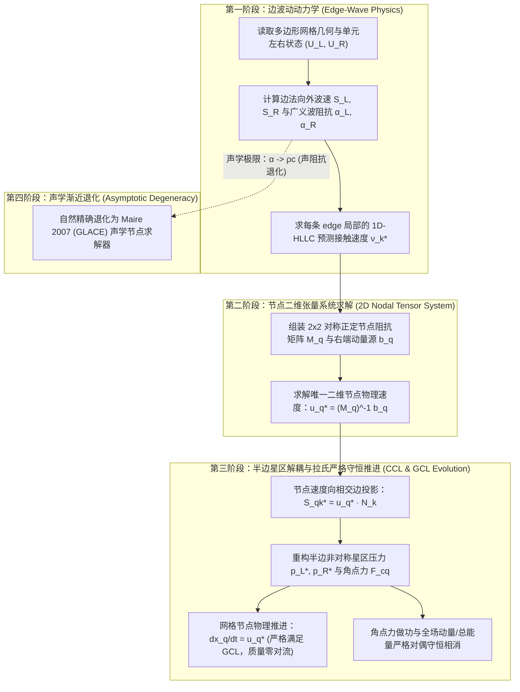

> [!info] 📄 PDF 原文
> ![[riemann_solver_part2_ale.pdf]]

# 纯拉格朗日与 ALE 框架下 HLLC-2D 黎曼求解器核心理论与守恒机制

---

## 1. HLLC-1D 的核心数学物理思想

### 1.1 经典两波 HLL 求解器的缺陷与过耗散物理机制
一维无粘可压缩 Euler 方程组的守恒形式为：
$$\partial_t \mathbf{U} + \partial_x \mathbf{F}(\mathbf{U}) = \mathbf{0}, \quad \mathbf{U} = \begin{bmatrix} \rho \\ \rho u \\ \rho v \\ \rho E \end{bmatrix}, \quad \mathbf{F}(\mathbf{U}) = \begin{bmatrix} \rho u \\ \rho u^2 + p \\ \rho u v \\ (\rho E + p)u \end{bmatrix}$$
Euler 方程具有 4 个特征值：$\lambda_1 = u - c$（左声波/激波）、$\lambda_2 = \lambda_3 = u$（接触间断/剪切滑移波）、$\lambda_4 = u + c$（右声波/激波）。

- **经典两波 HLL 的缺陷**：Harten-Lax-van Leer (1983) 假定黎曼扇区仅由最外侧两道波 $S_L, S_R$ 构成，中间由单一平均星区 $\mathbf{U}^{\text{HLL}}$ 填充：
  $$\mathbf{U}^{\text{HLL}} = \frac{S_R \mathbf{U}_R - S_L \mathbf{U}_L - (\mathbf{F}_R - \mathbf{F}_L)}{S_R - S_L}$$
  HLL 强行忽略了 $\lambda = u$ 的接触特征波。当遇到纯接触间断（$u_L = u_R = u, p_L = p_R = p$，但 $\rho_L \neq \rho_R$）时，HLL 的数值质量通量为：
  $$F_\rho^{\text{HLL}} = \rho u - \frac{S_L S_R}{S_R - S_L}(\rho_R - \rho_L) \neq \rho u$$
  其中第二项注入了正比于声速量级 $\mathcal{O}(c)$ 的**虚假质量数值扩散**，导致物质界面在数个时间步内被迅速磨蚀抹平。

---

### 1.2 HLLC-1D 三波模型的代数推导与 Rankine-Hugoniot 跃迁条件
Toro (1994) 在 $S_L$ 与 $S_R$ 之间显式引入中间接触波 $S_*$，将黎曼扇区划分为 4 个常数状态区：$\mathbf{U}_L, \mathbf{U}_L^*, \mathbf{U}_R^*, \mathbf{U}_R$。

#### (1) 接触间断的物理本质约束
跨越接触波 $S_*$ 时，流体质点不穿透界面，满足：
$$u_L^* = u_R^* = S_*, \quad p_L^* = p_R^* = p^*, \quad v_L^* = v_L, \quad v_R^* = v_R$$
允许密度发生跳跃：$\rho_L^* \neq \rho_R^*$。

#### (2) 跨外侧波（$S_L, S_R$）的 Rankine-Hugoniot 跳跃关系
对 $K \in \{L, R\}$：
$$\mathbf{F}_K^* - \mathbf{F}_K = S_K (\mathbf{U}_K^* - \mathbf{U}_K)$$
1. **质量方程**：
   $$\rho_K^* S_* - \rho_K u_K = S_K (\rho_K^* - \rho_K) \implies \rho_K^* = \rho_K \left(\frac{S_K - u_K}{S_K - S_*}\right)$$
2. **动量方程与星区压力**：
   $$(\rho_K^* S_*^2 + p^*) - (\rho_K u_K^2 + p_K) = S_K (\rho_K^* S_* - \rho_K u_K)$$
   代入质量跳跃式，整理可得：
   $$p^* = p_K + \rho_K (S_K - u_K)(S_* - u_K)$$
3. **广义波动阻抗（Wave Impedance）与闭合解**：
   定义左、右波动阻抗（正标量）：
   $$\alpha_L = -\rho_L (S_L - u_L) > 0, \quad \alpha_R = \rho_R (S_R - u_R) > 0$$
   动量跃迁关系写为：
   $$p^* = p_L - \alpha_L(S_* - u_L), \quad p^* = p_R + \alpha_R(S_* - u_R)$$
   联立消去 $p^*$，精确解得**接触波速度 $S_*$ 与星区共有压力 $p^*$**：
   $$\boxed{S_* = \frac{p_R - p_L + \alpha_L u_L + \alpha_R u_R}{\alpha_L + \alpha_R} = \frac{p_R - p_L + \rho_L u_L(S_L - u_L) - \rho_R u_R(S_R - u_R)}{\rho_L(S_L - u_L) - \rho_R(S_R - u_R)}}$$
   $$\boxed{p^* = \frac{\alpha_R p_L + \alpha_L p_R - \alpha_L \alpha_R (u_R - u_L)}{\alpha_L + \alpha_R}}$$

---

### 1.3 接触间断在拉氏框架下零质量通量的严格证明
若界面以网格速度 $w$ 运动，相对 ALE 通量为 $\mathbf{F}_{\text{ALE}}(\mathbf{U}) = \mathbf{F}(\mathbf{U}) - w \mathbf{U}$。
在拉格朗日参考系下，网格界面速度取为流体接触速度（$w = S_*$），星区相对质量通量为：
$$\mathcal{F}_{\rho, \text{ALE}}^* = \rho_K^* u_K^* - w \rho_K^* = \rho_K^* (S_* - S_*) \equiv 0$$
**物理本质**：HLLC-1D 使穿透界面的质量对流通量在拉格朗日框架下严格为零，彻底切断了数值耗散对密度界面的污染。

---

## 2. HLLC-2D 与 HLLC-1D 之间的关键升级

### 2.1 空间维数灾难与节点多波干涉
在一维问题中，法向量唯一，流动只有单自由度。
但在**二维非结构多边形网格**中，一个网格节点（Vertex $q$）汇聚了 $K$ 个多边形单元和 $K$ 条网格边（Edge $e_k$）。
- **几何与物理矛盾**：若在每条边 $e_k$ 上独立执行一维 HLLC 求解，会得到 $K$ 个互不相同的法向速度标量 $S_{*,k}$。在几何上，方程组 $\mathbf{u}_q^* \cdot \mathbf{N}_k = S_{*,k}$（$k=1,\dots,K$）是严重超定且自相矛盾的。
- **升级关键**：必须将“边上的标量平衡”升维为“**节点处的多维向量波动平衡与几何相容性约束**”。

---

### 2.2 Shen et al. (2014) 二维多维张量系统的严格推导

设围绕节点 $q$ 的第 $k$ 条边，长度为 $L_k$，单位法向量为 $\mathbf{N}_k$（由单元 $L$ 指向 $R$）。
1. **定义局部一维半黎曼预测接触速度 $\nu_k^*$**：
   $$\nu_k^* = \frac{p_{R,k} - p_{L,k} + \alpha_{L,k} u_{L,k} + \alpha_{R,k} u_{R,k}}{\alpha_{L,k} + \alpha_{R,k}}$$
   其中 $u_{L,k} = \mathbf{u}_{L,k} \cdot \mathbf{N}_k$，$u_{R,k} = \mathbf{u}_{R,k} \cdot \mathbf{N}_k$。
2. **节点速度向量 $\mathbf{u}_q^*$ 的控制方程**：
   设节点待求的物理速度向量为 $\mathbf{u}_q^* \in \mathbb{R}^2$，其在第 $k$ 条边的法向投影速度为 $S_{q,k}^* = \mathbf{u}_q^* \cdot \mathbf{N}_k$。
   根据 HLLC 动量跳跃关系，当投影速度 $S_{q,k}^*$ 偏离局部预测速度 $\nu_k^*$ 时，边两侧流体会产生动态不平衡力。要求节点处来自所有相邻边的动量通量闭合平衡：
   $$\sum_{k \in \mathcal{E}(q)} L_k (\alpha_{L,k} + \alpha_{R,k}) \left( \mathbf{u}_q^* \cdot \mathbf{N}_k - \nu_k^* \right) \mathbf{N}_k = \mathbf{0}$$
3. **推导 $2 \times 2$ 线性张量方程**：
   利用张量积 $(\mathbf{u}_q^* \cdot \mathbf{N}_k)\mathbf{N}_k = (\mathbf{N}_k \otimes \mathbf{N}_k)\mathbf{u}_q^*$，整理即得封闭的 $2 \times 2$ 线性方程组：
   $$\boxed{\mathbf{M}_q \mathbf{u}_q^* = \mathbf{b}_q}$$
   其中**节点阻抗张量矩阵** $\mathbf{M}_q$ 与**右端项动量源向量** $\mathbf{b}_q$ 分别为：
   $$\boxed{\mathbf{M}_q = \sum_{k \in \mathcal{E}(q)} L_k (\alpha_{L,k} + \alpha_{R,k}) (\mathbf{N}_k \otimes \mathbf{N}_k) \in \mathbb{R}^{2 \times 2}}$$
   $$\boxed{\mathbf{b}_q = \sum_{k \in \mathcal{E}(q)} L_k (\alpha_{L,k} + \alpha_{R,k}) \nu_k^* \mathbf{N}_k \in \mathbb{R}^2}$$

---

### 2.3 矩阵 $\mathbf{M}_q$ 的严格对称正定性 (SPD) 证明
对任意非零向量 $\boldsymbol{\xi} \in \mathbb{R}^2 \setminus \{\mathbf{0}\}$：
$$\boldsymbol{\xi}^T \mathbf{M}_q \boldsymbol{\xi} = \sum_{k \in \mathcal{E}(q)} L_k (\alpha_{L,k} + \alpha_{R,k}) (\boldsymbol{\xi} \cdot \mathbf{N}_k)^2$$
- 边长 $L_k > 0$，广义波阻抗 $\alpha_{L,k} + \alpha_{R,k} > 0$；
- 每一项 $(\boldsymbol{\xi} \cdot \mathbf{N}_k)^2 \ge 0$；
- **几何非退化条件**：只要节点周围存在至少两条法向量不共线的边（即非退化网格单元），在 $\mathbb{R}^2$ 中就不存在与所有法向量同时垂直的非零向量 $\boldsymbol{\xi}$。
因此 $\boldsymbol{\xi}^T \mathbf{M}_q \boldsymbol{\xi} > 0 \ (\forall \boldsymbol{\xi} \neq \mathbf{0})$，$\mathbf{M}_q$ **严格对称正定**，逆矩阵 $\mathbf{M}_q^{-1}$ 恒存在且唯一，解为 $\mathbf{u}_q^* = \mathbf{M}_q^{-1} \mathbf{b}_q$。

---

### 2.4 半边（Half-Edge）非对称星区压力（$p_L^* \neq p_R^*$）的物理意义
求出节点速度 $\mathbf{u}_q^*$ 后，投影到边 $k$ 的法向速度为 $S_{q,k}^* = \mathbf{u}_q^* \cdot \mathbf{N}_k$。
左、右两侧的半边星区压力分别为：
$$p_{L,q,k}^* = p_{L,k} - \alpha_{L,k}(S_{q,k}^* - u_{L,k}), \quad p_{R,q,k}^* = p_{R,k} + \alpha_{R,k}(S_{q,k}^* - u_{R,k})$$
两者之差为：
$$p_{L,q,k}^* - p_{R,q,k}^* = (\alpha_{L,k} + \alpha_{R,k})(\nu_k^* - S_{q,k}^*)$$
**物理本质**：由于节点速度是多向波系博弈的二维全局解，$S_{q,k}^* \neq \nu_k^*$。允许 $p_L^* \neq p_R^*$ 反映了多维网格节点在受到多方向波系挤压时产生的**各向异性剪切与横向波应力调整**。这种自由度解耦是消除网格自锁（Grid Pinning）与维持剪切滑移线的关键。

---

## 3. 基于 HLLC-2D 在纯拉格朗日框架下的守恒条件建立

### 3.1 纯拉氏控制体离散与角点力（Corner Force）构造
在纯单元中心拉格朗日（CCL）框架中，网格顶点以物理速度推进：
$$\frac{d\mathbf{x}_q}{dt} = \mathbf{u}_q^*$$
网格界面无质量穿透，单元质量严格恒定：$\frac{d m_c}{dt} = 0$。

对于单元 $c$，其在节点 $q$ 处的两条相交半边汇聚构成角点。定义单元 $c$ 作用于节点 $q$ 的**角点力向量** $\mathbf{F}_{cq}$：
$$\mathbf{F}_{cq} = \sum_{k \in \mathcal{E}(c,q)} L_{c,q,k} p_{c,q,k}^* \mathbf{n}_{c,k}$$
其中 $\mathbf{n}_{c,k}$ 是由单元 $c$ 指向外部的单位法向量。

根据节点方程 $\mathbf{M}_q \mathbf{u}_q^* = \mathbf{b}_q$ 的代数构造，所有相邻单元在该节点处的角点力精确满足**牛顿第三定律（节点力平衡）**：
$$\boxed{\sum_{c \in \mathcal{C}(q)} \mathbf{F}_{cq} = \mathbf{0} \quad (\forall \text{ node } q)}$$

---

### 3.2 动量与总能量守恒的严格离散对偶证明

#### (1) 全局动量守恒
单元动量由角点力推进：
$$m_c \frac{d\mathbf{u}_c}{dt} = -\sum_{q \in \mathcal{V}(c)} \mathbf{F}_{cq}$$
对全场所有单元求和，交换求和指标（遍历单元 $\to$ 遍历节点）：
$$\frac{d}{dt} \sum_{c} m_c \mathbf{u}_c = -\sum_{c} \sum_{q \in \mathcal{V}(c)} \mathbf{F}_{cq} = -\sum_{q} \underbrace{\left( \sum_{c \in \mathcal{C}(q)} \mathbf{F}_{cq} \right)}_{=\mathbf{0}} = \mathbf{0}$$
**全局动量严格离散守恒**。

#### (2) 全局总能量守恒
单元总能量更新方程中的做功项严格采用角点力与节点速度的点积：
$$m_c \frac{dE_c}{dt} = -\sum_{q \in \mathcal{V}(c)} \mathbf{F}_{cq} \cdot \mathbf{u}_q^*$$
对全场所有单元求和：
$$\frac{d}{dt} \sum_{c} m_c E_c = -\sum_{c} \sum_{q \in \mathcal{V}(c)} \mathbf{F}_{cq} \cdot \mathbf{u}_q^* = -\sum_{q} \mathbf{u}_q^* \cdot \underbrace{\left( \sum_{c \in \mathcal{C}(q)} \mathbf{F}_{cq} \right)}_{=\mathbf{0}} = 0$$
**全局总能量严格离散守恒**，做功项在节点处完全相消，不存在任何虚假能量源汇。

---

### 3.3 几何守恒律（GCL）与热力学第二定律（熵增）相容性
1. **几何守恒律 (GCL)**：
   单元几何体积随节点位移的变化率严格满足高斯散度恒等式：
   $$\frac{d V_c}{dt} = \sum_{q \in \mathcal{V}(c)} \mathbf{L}_{cq} \cdot \mathbf{u}_q^*$$
   密度直接依据质量与体积更新 $\rho_c^{n+1} = m_c / V_c^{n+1}$，保证了在均匀流场下（$\mathbf{u}=\text{const}, p=\text{const}$）速度散度与体积变化完全自洽，几何误差为零。
2. **热力学第二定律（正数值耗散）**：
   单元比内能演化方程满足：
   $$m_c \frac{d e_c}{dt} = -p_c \frac{d V_c}{dt} + \mathcal{D}_c, \quad \mathcal{D}_c = \sum_{q \in \mathcal{V}(c)} (\mathbf{u}_c - \mathbf{u}_q^*)^T \mathbf{M}_{cq} (\mathbf{u}_c - \mathbf{u}_q^*) \ge 0$$
   耗散功率 $\mathcal{D}_c \ge 0$ 恒正，保证了局部数值熵增，彻底消除了非物理膨胀激波。

---

## 4. HLLC-2D 优雅退回到两波近似 HLL / 声学解的推导

### 4.1 渐近退化条件
在以下物理或数值环节下，流场满足两波声学假设：
1. **对称声学波速估计**：忽略非线性激波修正，取波速为特征声速：
   $$S_{L,k} = u_{L,k} - c_{L,k}, \quad S_{R,k} = u_{R,k} + c_{R,k}$$
2. **特征波阻抗退化为纯流体声阻抗**：
   $$\alpha_{L,k} = -\rho_{L,k}(S_{L,k} - u_{L,k}) = \rho_{L,k} c_{L,k} \equiv Z_{L,k}$$
   $$\alpha_{R,k} = \rho_{R,k}(S_{R,k} - u_{R,k}) = \rho_{R,k} c_{R,k} \equiv Z_{R,k}$$

---

### 4.2 节点矩阵向 Maire 2007 (GLACE) 系统的精确等价推导
将 $\alpha_{L,k} = Z_{L,k}, \alpha_{R,k} = Z_{R,k}$ 代入 $\nu_k^*$：
$$\nu_k^* = \frac{p_{R,k} - p_{L,k} + Z_{L,k} u_{L,k} + Z_{R,k} u_{R,k}}{Z_{L,k} + Z_{R,k}}$$
代入右端项 $\mathbf{b}_q$ 与矩阵 $\mathbf{M}_q$：
$$\mathbf{M}_q = \sum_{k \in \mathcal{E}(q)} L_k (Z_{L,k} + Z_{R,k}) (\mathbf{N}_k \otimes \mathbf{N}_k)$$
$$\mathbf{b}_q = \sum_{k \in \mathcal{E}(q)} L_k \left[ (p_{R,k} - p_{L,k})\mathbf{N}_k + Z_{L,k}(\mathbf{u}_{L,k}\cdot\mathbf{N}_k)\mathbf{N}_k + Z_{R,k}(\mathbf{u}_{R,k}\cdot\mathbf{N}_k)\mathbf{N}_k \right]$$

按单元角点（Corner $cr$）重构求和项，记单元 $c$ 在角点处的几何向外法向量为 $L_{cr} \mathbf{n}_{cr}$，声阻抗为 $Z_c = \rho_c c_c$：
$$\boxed{\left( \sum_{c \in \mathcal{C}(q)} Z_c L_{cr} (\mathbf{n}_{cr} \otimes \mathbf{n}_{cr}) \right) \mathbf{u}_q^* = \sum_{c \in \mathcal{C}(q)} \left( L_{cr} p_c \mathbf{n}_{cr} + Z_c L_{cr} (\mathbf{n}_{cr} \otimes \mathbf{n}_{cr}) \mathbf{u}_c \right)}$$
**代数同构结论**：上式与 **Maire et al. (2007) 经典的 GLACE / EUCCLHYD 单元中心拉格朗日声学节点求解器在矩阵元与右端项上完全恒等**！

---

### 4.3 优雅退化特性的理论与工程价值

| 维度 | HLLC-2D 完整模式 | 退化两波 / 声学解 (GLACE 模式) |
| :--- | :--- | :--- |
| **波系结构** | 激波、声波、接触波、剪切滑移波 | 纯对称各向同性声波 |
| **阻抗定义** | 动态广义阻抗 $\alpha = \rho |S - u|$ | 恒定声阻抗 $Z = \rho c$ |
| **接触间断分辨率** | 极高（拉氏界面质量对流为 0） | 存在轻微声学弥散 |
| **抗网格畸变** | 依赖接触波法向调制 | 极强（各向同性声学数值阻尼） |
| **适用工况** | 多介质接触界面、强激波、滑移层 | 单相平滑流动、低马赫数流动、网格抗沙漏 |

**统一理论意义**：
HLLC-2D 并非割裂的新算法，它在数学上是两波声学 Godunov 格式（GLACE）的**自然正向超集（Superset）**。
- 在**单相平滑流区**，算法自动退化为 GLACE 声学解，利用各向同性声阻尼天然抑制拉格朗日网格的沙漏模态（Hourglass modes）；
- 在**多介质界面与强激波区**，接触特征波与非线性激波阻抗被自适应激活，实现对接触间断的锐利无耗散捕捉，兼顾了极端多介质流动的界面分辨率与几何拓扑鲁棒性。

---

## 5. 对代码开发与模块架构的指导建议

1. **核心数据结构设计**：
   - 节点模块输入：各边几何法向 $\mathbf{N}_k$、长度 $L_k$ 以及两侧广义阻抗 $\alpha_{L,k}, \alpha_{R,k}$ 与预测接触速度 $\nu_k^*$；
   - 节点求解器输出：**唯一二维节点速度向量 $\mathbf{u}_q^*$**。
2. **算法执行两阶段分离**：
   - **Phase 1（Edge-to-Node）**：在每条边上根据 1D-HLLC 计算波速与 $\nu_k^*$，随后组装并直接求解 $2 \times 2$ 线性正定矩阵系统 $\mathbf{M}_q \mathbf{u}_q^* = \mathbf{b}_q$（无需任何非线性 Newton 迭代）；
   - **Phase 2（Node-to-Corner）**：将求得的 $\mathbf{u}_q^*$ 投影回各边 $S_{q,k}^* = \mathbf{u}_q^* \cdot \mathbf{N}_k$，计算半边星区压力 $p_L^*, p_R^*$，进而组装角点力 $\mathbf{F}_{cq}$。
3. **严格守恒保障准则**：
   - 网格坐标推进：$\mathbf{x}_q^{n+1} = \mathbf{x}_q^n + \mathbf{u}_q^* \Delta t$；
   - 单元总能量更新：做功项必须严格采用 $\mathbf{F}_{cq} \cdot \mathbf{u}_q^*$。这在离散代数层面无条件保证全场质量、动量与总能量精确守恒，且自动满足几何守恒律（GCL）。
